# 🏠 Delhi NCR House Price Prediction

An end-to-end Machine Learning project that predicts residential property prices in the Delhi NCR region using multiple regression algorithms.

The project demonstrates the complete ML workflow:

- Data Cleaning
- Exploratory Data Analysis (EDA)
- Data Visualization
- Feature Selection
- Linear Regression (Baseline Model)
- Decision Tree Regression
- Hyperparameter Tuning
- Model Evaluation
- User Prediction
- Streamlit Frontend

---

# 📌 Dataset

**Dataset:** Delhi NCR Housing Dataset 2025

**Source:**
https://www.kaggle.com/datasets/aabhas2351/delhi-ncr-housing-dataset-2025

**License:** CC0 1.0 (Public Domain)

---

# 🎯 Features Used

### Input Features

- Area (sq ft)
- Number of Bedrooms (BHK)
- Parking Spaces

### Target Variable

- House Price

---

# 🛠 Technologies Used

- Python
- Pandas
- NumPy
- Matplotlib
- Seaborn
- Scikit-Learn
- Joblib
- Streamlit

---

# 📊 Exploratory Data Analysis

Performed extensive EDA using:

- Correlation Heatmap
- Area vs Price
- BHK vs Price
- Parking vs Price

---

# 📷 EDA Visualizations

## Correlation Heatmap


---

## Area vs Price


---

## BHK vs Price

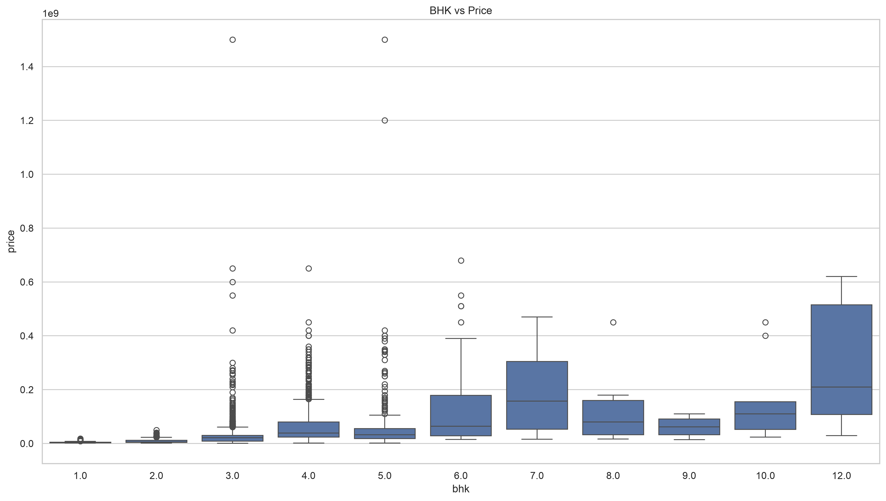

---

## Parking vs Price

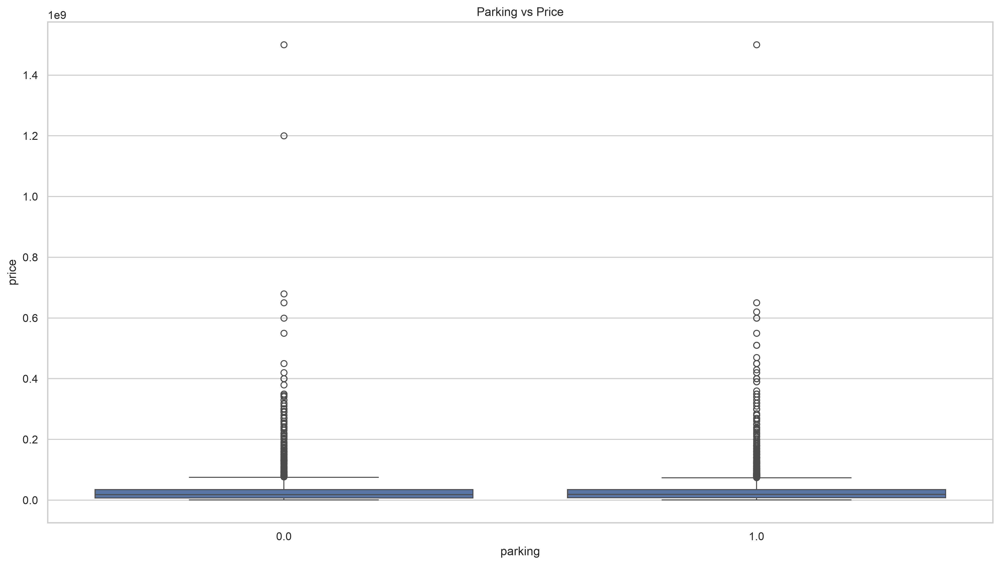

---

# 🤖 Machine Learning Models

## 1️⃣ Linear Regression

Used as the baseline regression model.

### Evaluation Metrics

- Mean Absolute Error (MAE): ₹1.72 Cr
- Root Mean Squared Error (RMSE): 3.06 Cr
- R² Score: 0.459

### Visualizations

#### Actual vs Predicted

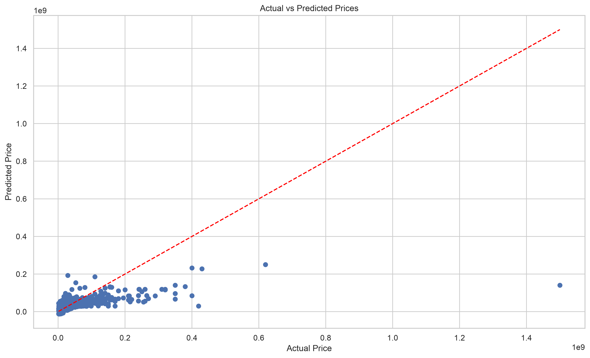

#### Residual Plot

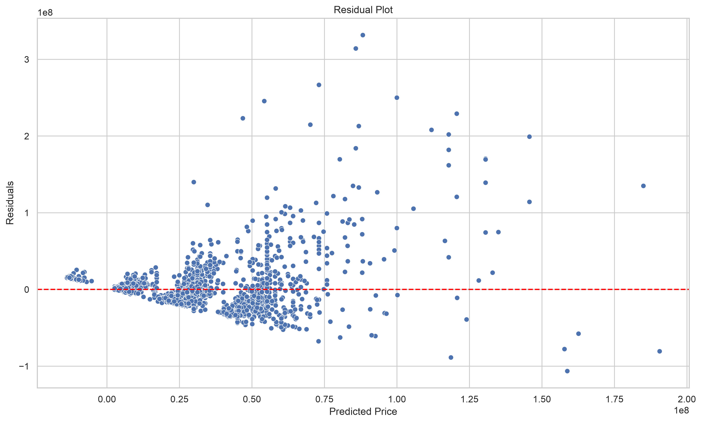

---

## 2️⃣ Decision Tree Regression

Implemented Decision Tree Regression to capture non-linear relationships in housing prices.

### Hyperparameter Tuning

Compared multiple tree depths and selected the best-performing model.

Best parameter:

```text
max_depth = 5
```

### Evaluation Metrics

- MAE: ₹1.10 Cr
- RMSE: ₹2.36 Cr
- R² Score: 0.677

### Visualizations

#### Actual vs Predicted


#### Residual Plot

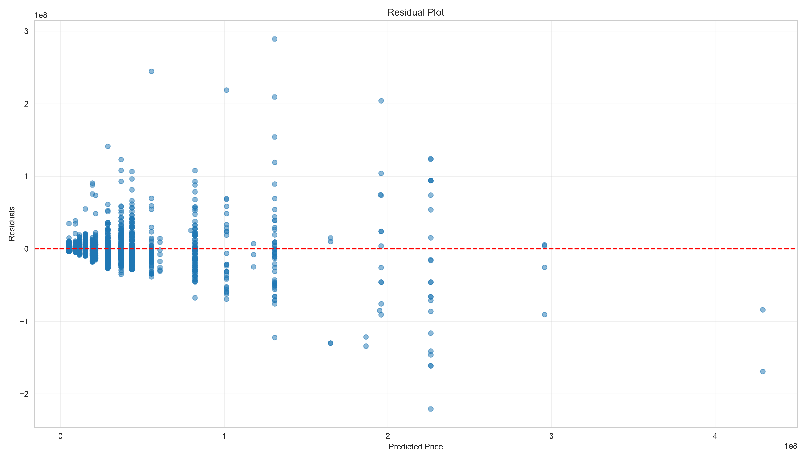

---

## 3️⃣ Random Forest Regression

Implemented Random Forest Regression to capture non-linear relationships in housing prices.

### Hyperparameter Tuning

Compared multiple depths, n_estimators and selected the best-performing model.

Best parameter:

```text
max_depth = 7
n_estimators=200
```

### Evaluation Metrics

- MAE: ₹1.05 Cr
- RMSE: ₹2.30 Cr
- R² Score: 0.695 

### Visualizations

#### Actual vs Predicted

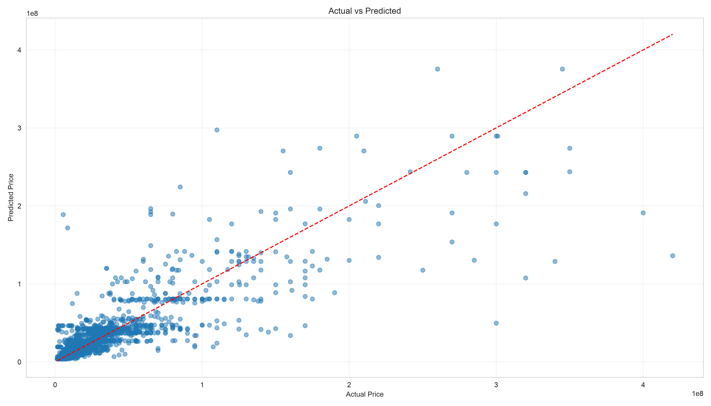

#### Residual Plot

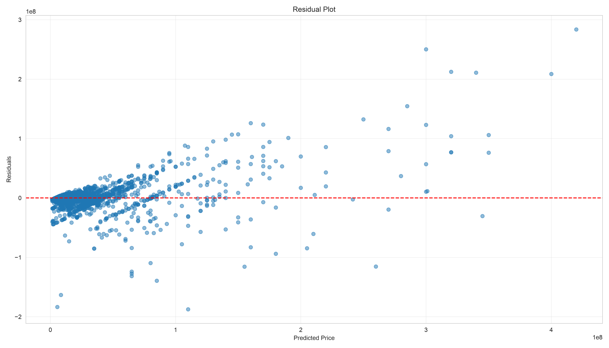

---

## 4️⃣ Polynomial Regression

Implemented Polynomial Regression to capture non-linear relationships by creating polynomial features while still using Linear Regression as the learning algorithm.

### Hyperparameter Tuning

Compared multiple polynomial degrees and selected the best-performing model.

Best parameter:

```text
Degree = 2
```

### Evaluation Metrics

- MAE: ₹1.30 Cr
- RMSE: ₹2.42 Cr
- R² Score: 0.66

### Visualizations

#### Polynomial Degree vs RMSE

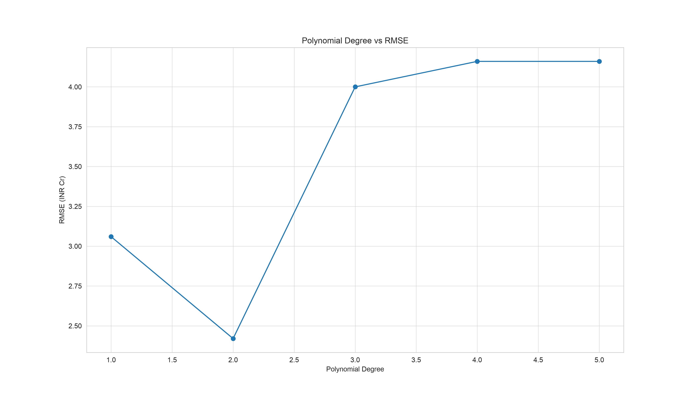

### Key Learning

- Polynomial Regression creates new polynomial features (e.g., Area², Area × BHK) before training.
- Degree 2 improved performance over Linear Regression.
- Higher degrees (3–5) caused overfitting and reduced accuracy.

---

# 🌐 Streamlit Frontend

A simple interactive web application was built using Streamlit.

Users can enter:

- Area
- BHK
- Parking Spaces

and instantly receive an estimated property price.

## Home Page

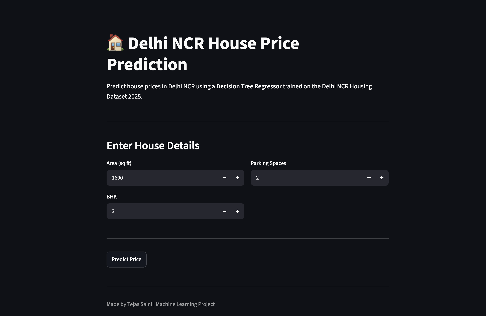

---

## Prediction Example

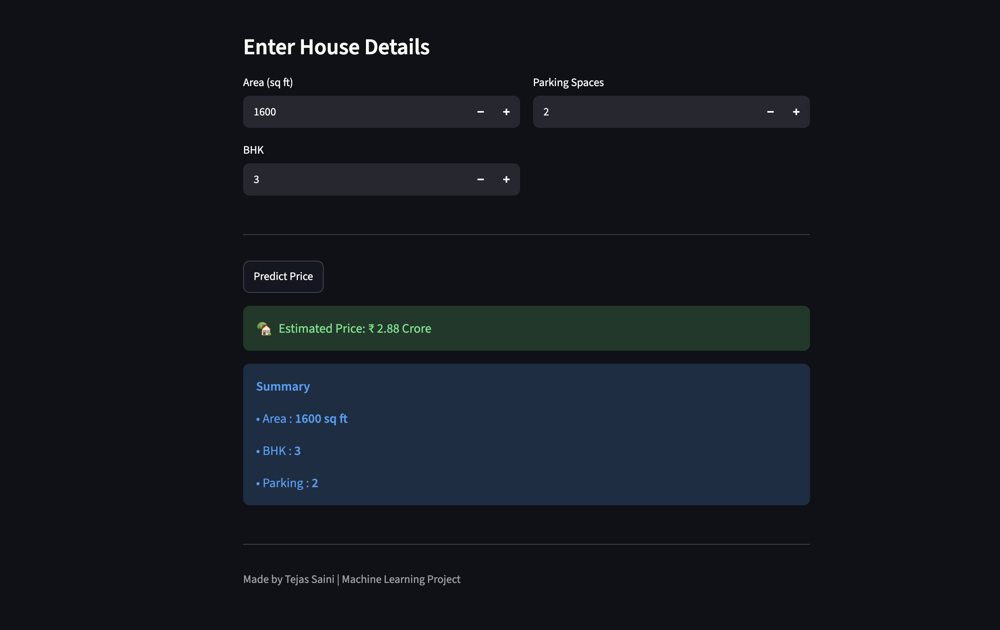

---

## Another Prediction Example

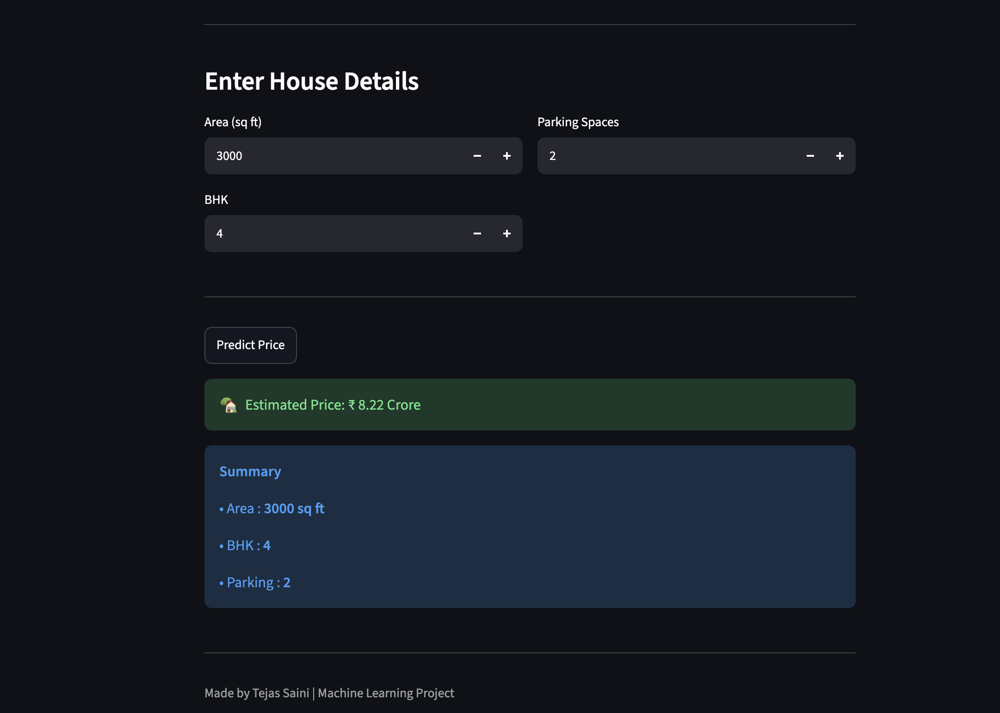

---

# 📁 Project Structure

```text
Delhi NCR House Price Prediction/

│
├── app.py
├── README.md
├── LICENSE
├── requirements.txt
│
├── data/
│
├── models/
│   ├── linear_regression_model.pkl
│   └── decision_tree_model.pkl
│   └── random_forest_model.pkl
│   └── polynomial_regression_model.pkl
│
├── notebooks/
│   ├── 01_EDA_Linear_Regression.ipynb
│   └── 02_Decision_Tree.ipynb
│   └── 03_Random_Forest.ipynb
│   └── 04_Polynomial_Regression.ipynb
│
├── outputs/
│   ├── plots/
│   ├── predictions/
│   └── screenshots/
│
└── .gitignore
```

---

# 🚀 How to Run

Clone the repository

```bash
git clone https://github.com/tejassainids/delhi-ncr-house-price-prediction.git
```

Move into the project

```bash
cd delhi-ncr-house-price-prediction
```

Install dependencies

```bash
pip install -r requirements.txt
```

Run the application

```bash
streamlit run app.py
```

---

## 🚀 Live Demo

🌐 **Try the application here:**

https://delhincrhousepriceprediction-tejas.streamlit.app

---

# 📚 Learning Outcomes

This project strengthened my understanding of:

- Data preprocessing and feature selection
- Exploratory Data Analysis (EDA)
- Data visualization using Matplotlib
- Building regression models with:
- Linear Regression
- Decision Tree Regressor
- Random Forest Regressor
- Hyperparameter tuning (max_depth, n_estimators)
- Model evaluation using MAE, RMSE, and R² Score
- Residual analysis and Actual vs Predicted visualization
- Comparing multiple models to select the best performer
- Saving and loading trained models with Joblib
- Building an interactive Streamlit web application
- Deploying a Machine Learning model on Streamlit Community Cloud
- Managing project versions with Git and GitHub
- Developing an end-to-end Machine Learning workflow

---

# 💡 Future Improvements

- Random Forest Regression
- XGBoost
- Feature Importance
- Cross Validation
- Model Comparison Dashboard
- Cloud Deployment

---

# 👨‍💻 Author

**Tejas Saini**

B.Tech Data Science Student

GitHub:
https://github.com/tejassainids

Live Demo:
https://delhincrhousepriceprediction-tejas.streamlit.app

---
