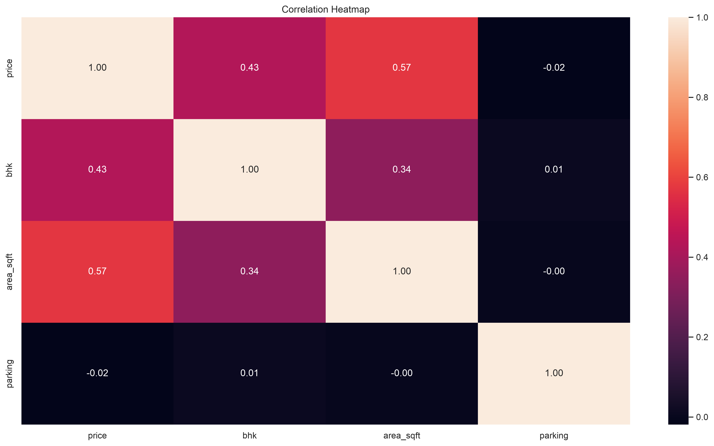
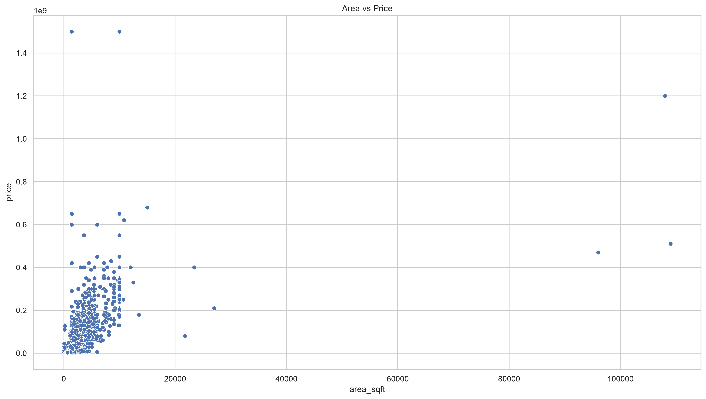
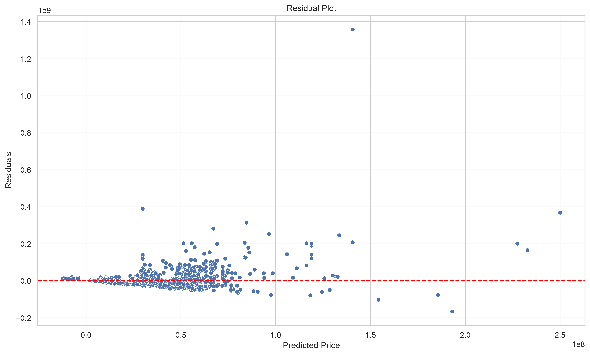

# 🏠 Delhi NCR House Price Prediction using Linear Regression

A Machine Learning regression project that predicts residential property prices in the Delhi NCR region using **Linear Regression**. This project demonstrates the complete end-to-end Machine Learning workflow, from data exploration to model deployment-ready persistence.

---

## 📌 Project Overview

The objective of this project is to estimate house prices using numerical property features and evaluate the performance of a Linear Regression model.

The project covers:

* Data preprocessing
* Exploratory Data Analysis (EDA)
* Data visualization
* Feature selection
* Model training
* Model evaluation
* Residual analysis
* Saving the trained model
* Predicting prices for new houses

---

## 📂 Dataset

**Dataset:** Delhi NCR Housing Dataset 2025

Source:
https://www.kaggle.com/datasets/aabhas2351/delhi-ncr-housing-dataset-2025

**License:** CC0 1.0 (Public Domain)

---

## 🎯 Features Used

Input Features:

* Area (sq ft)
* Number of Bedrooms (BHK)
* Parking Spaces

Target Variable:

* House Price

---

## 🛠️ Technologies Used

* Python
* Pandas
* NumPy
* Matplotlib
* Seaborn
* Scikit-learn
* Joblib

---

## 📊 Exploratory Data Analysis

The following visualizations were created:

* Correlation Heatmap
* Area vs Price
* BHK vs Price
* Parking vs Price
* Residual Plot
* Actual vs Predicted Plot

---

## 🤖 Machine Learning Pipeline

1. Import Libraries
2. Load Dataset
3. Exploratory Data Analysis
4. Correlation Analysis
5. Feature Selection
6. Train-Test Split
7. Linear Regression Model Training
8. House Price Prediction
9. Model Evaluation
10. Residual Analysis
11. Save Model using Joblib
12. User Input Prediction

---

## 📈 Model Evaluation

The model was evaluated using:

* Mean Absolute Error (MAE)
* Mean Squared Error (MSE)
* Root Mean Squared Error (RMSE)
* R² Score

The project also includes residual analysis to understand model performance and prediction errors.

---

## 📁 Project Structure

```text
House_Price_Predictor/
│
├── data/
│
├── models/
│   └── house_price_model.pkl
│
├── notebooks/
│   └── house_price_predictor.ipynb
│
├── outputs/
│   ├── actual_vs_predicted.png
│   ├── area_vs_price.png
│   ├── bhk_vs_price.png
│   ├── correlation_heatmap.png
│   ├── parking_vs_price.png
│   ├── predictions.csv
│   └── residual_plot.png
│
├── requirements.txt
├── LICENSE
└── README.md
```

---

## 📷 Project Visualizations

### Correlation Heatmap



---

### Area vs Price



---

### Actual vs Predicted Prices


---

### Residual Plot



---

## 🚀 Installation

Clone the repository:

```bash
git clone https://github.com/tejassainids/delhi-ncr-house-price-prediction.git
```

Install dependencies:

```bash
pip install -r requirements.txt
```

Run the notebook to reproduce the complete workflow.

---

## 💡 Future Improvements

* Add Location as a feature
* Include Property Type
* Include Property Age
* Handle Outliers
* Feature Engineering
* Compare with:

  * Decision Tree Regression
  * Random Forest Regression
  * XGBoost

---

## 📚 Learning Outcomes

This project helped reinforce the following concepts:

* Exploratory Data Analysis (EDA)
* Data Visualization
* Feature Selection
* Train-Test Split
* Linear Regression
* MAE, MSE, RMSE and R²
* Residual Analysis
* Saving and Loading ML Models
* End-to-End Machine Learning Workflow

---

## 📜 License

This project is licensed under the MIT License.
